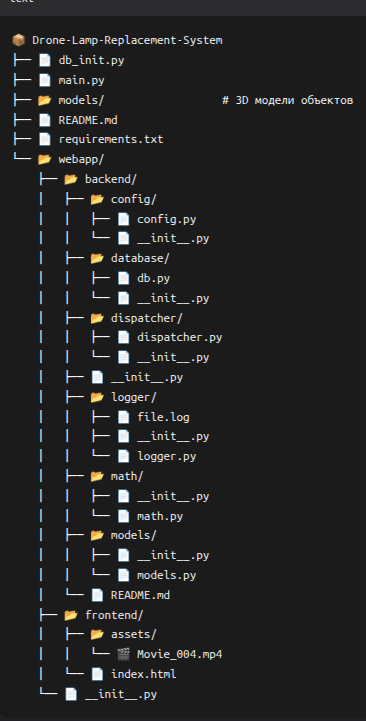

# Drone Lamp Replacement System 🛸💡
> Ранний прототип backend’а для системы автоматизированной замены уличных ламп/картриджей с помощью БПЛА.  
> Сейчас в репозитории: **FastAPI + WebSocket “эхо”** (техническая заготовка под телеметрию/управление).

<p align="left">
  
  
  
</p>

---

## О проекте
Идея: дроны обслуживают уличные светильники (замена картриджа/лампы), а софт отвечает за:
- приём телеметрии и событий,
- диспетчеризацию задач (миссии на замену),
- учёт состояния светильников/картриджей,
- (в будущем) визуализацию “цифрового двойника”.

**Важно:** текущая версия — не “готовая система”, а стартовая точка: минимальный сервер и WebSocket-канал.

---

## Содержимое репозитория



## Быстрый старт 🚀

### 1) Требования
- Python **3.10+** (рекомендуется)
- pip / venv

### 2) Установка
```bash
Перходим в корневую папку
заходим в .env
DATABASE_URL=postgresql://<имя пользователя>:<пароль>@localhost:<порт>/<название бд>
YANDEX_MAPS_API_KEY=ВАШ АПИ КЛЮЧ

Пишем в терминал
python -m venv .venv
# Linux/macOS:
source .venv/bin/activate
# Windows (PowerShell):
# .venv\Scripts\Activate.ps1

#Устанавливаем зависимости
pip install -r requirements.txt

#Инициализируем базу данных
python init_db.py

#запускаем веб-сервер
uvicorn main:app --reload --host 0.0.0.0 --port 8000